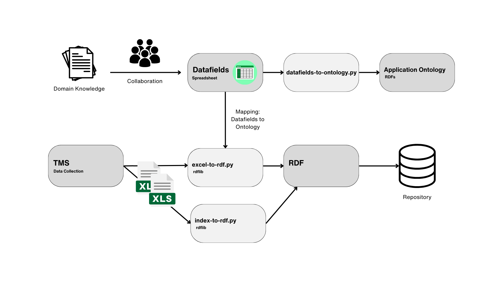
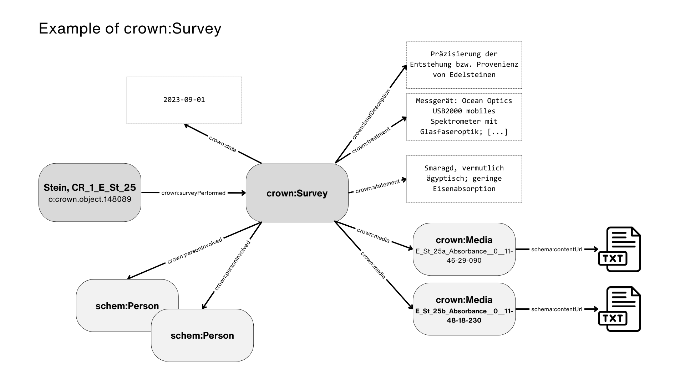
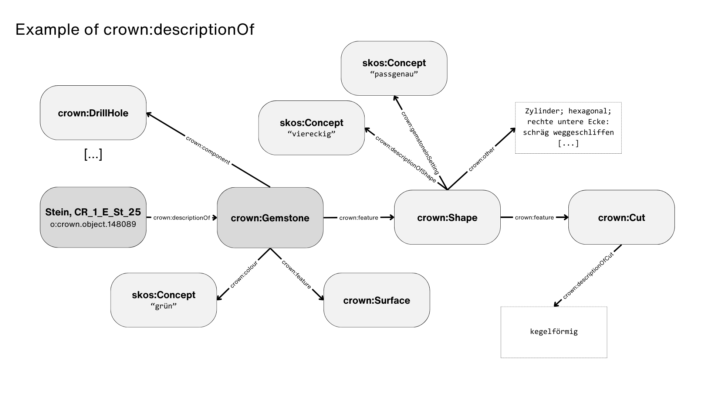
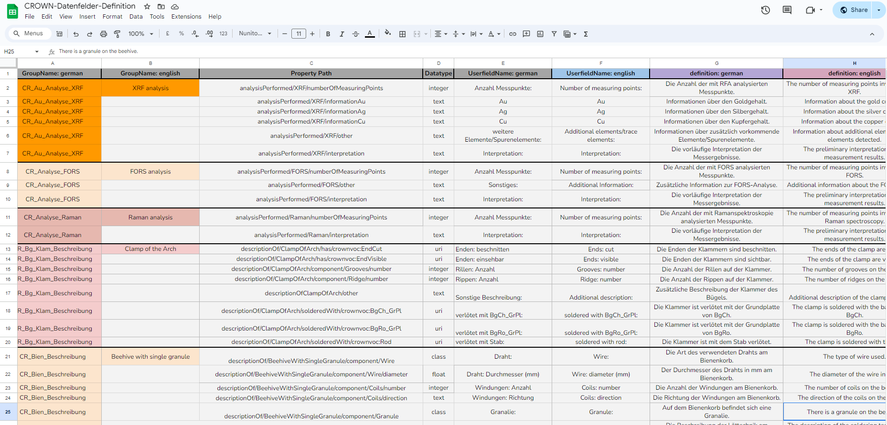
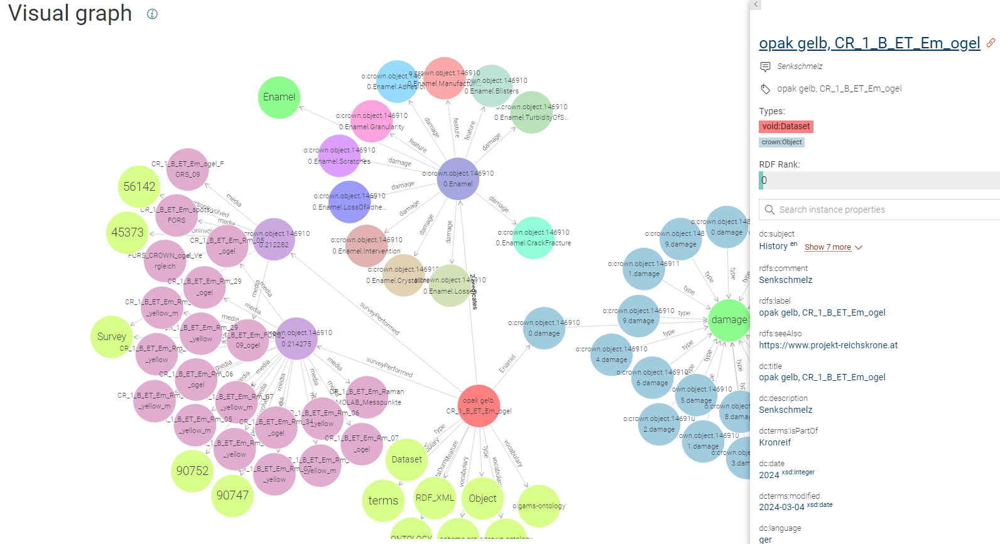
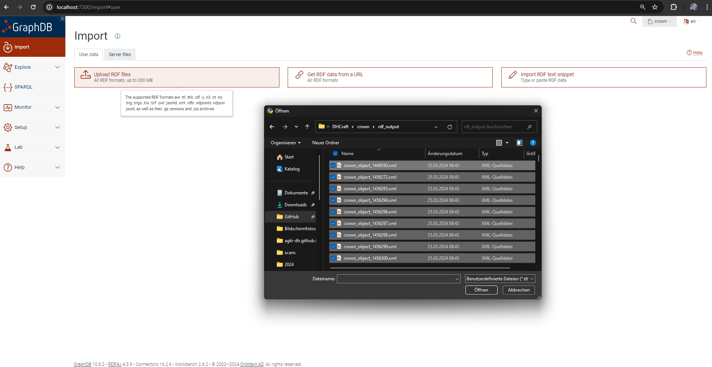
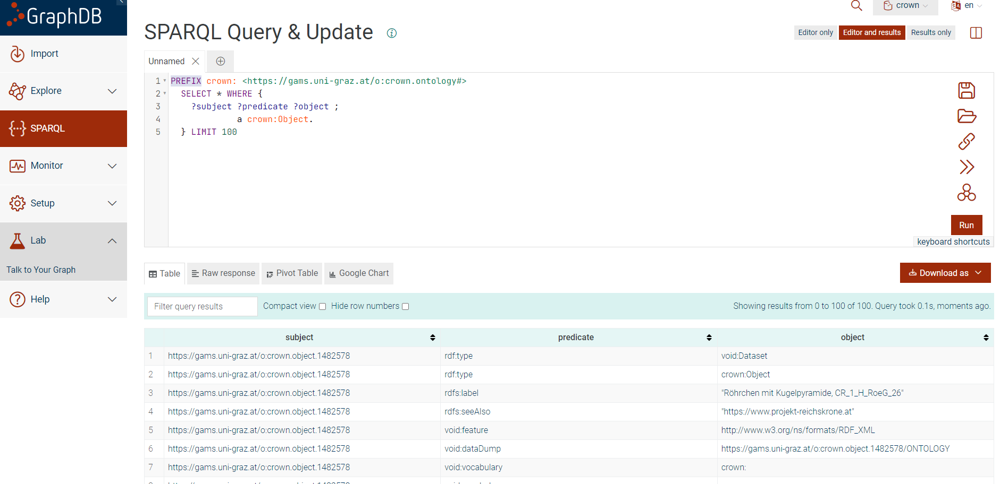
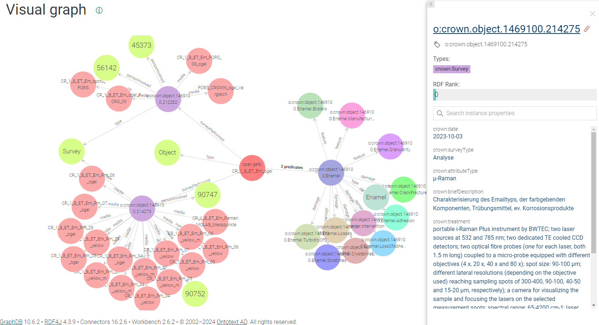
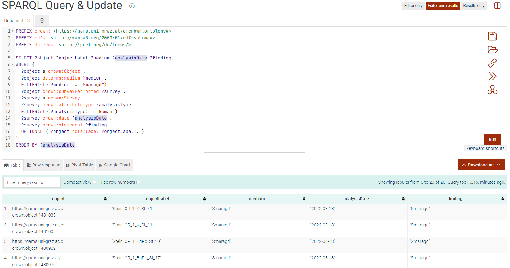

# Sharing the CROWN – Establishing a Workflow from Collection Data to Linked Research Data

[CLARIAH-AT - Funding Call 2022: Interoperability and Reusability of DH Data and Tools](https://clariah.at/project-funding)

* Project Investigator (KHM): Dr Martina Griesser, KHM-Museumsverband, Vienna
* Project Investigator (ZIM): Christopher Pollin, ZIM, University of Graz
* Author: Christopher Pollin

#### Objectives of the Document
  * Provide guidance on how to establish a workflow that transforms collection data from The Museum System (TMS) into structured, linked research data according to FAIR principles.
  * Outline the steps involved in the data transformation process, including data export, processing and conversion to RDF format.
  * Introduce the tools and scripts used in the workflow and explain their role in data extraction, ontology mapping and RDF creation.
  * Describe in detail the development and structure of the application ontology, focusing on how it facilitates the integration of museum data with domain ontologies.
#### Prerequisites
  * Basic understanding of museum data management
  * Knowledge of RDF, RDFs and basic data modelling
  * Python basics

## Table of Contents

- [1. Introduction](#introduction)
  - [1.1 About the CROWN Project](#about-the-crown-project)
  - [1.2 CLARIAH-AT: Sharing the CROWN](#clariah-at-sharing-the-crown)
- [2. Workflow Overview](#workflow-overview)
  - [2.1 TMS and Export](#tms-and-export)
  - [2.2 Data Transformation Scripts](#data-transformation-scripts)
    - [2.2.1 excel-to-rdf.py](#excel-to-rdfpy)
    - [2.2.2 index-to-rdf.py](#index-to-rdfpy)
    - [2.2.3 thesaurus-to-rdf.py](#thesaurus-to-rdfpy)
    - [2.2.4 datafields-to-ontology.py](#datafields-to-ontologypy)
- [3. Application Ontology](#application-ontology)
  - [3.1 Introduction to the "CROWN" Ontology](#introduction-to-the-crown-ontology)
  - [3.2 Building the Ontology](#building-the-ontology)
- [4. Using GraphDB for Data Reuse](#using-graphdb-for-data-reuse)
  - [4.1 Setting up GraphDB and Ingesting RDF Data](#setting-up-graphdb-and-ingesting-rdf-data)
  - [4.2 Exploring Your Data with GraphDB](#exploring-your-data-with-graphdb)
- [5. CROWN SPARQL Examples](#crown-sparql-examples)
  - [5.1 Executing the SPARQL Query](#executing-the-sparql-query)
  - [5.2 Example Query](#example-query)

## Introduction

### About the CROWN Project

The CROWN project is an interdisciplinary research project focusing on the Imperial Crown of the Holy Roman Empire. It combines fields such as art history, history, conservation science and technological analysis. The aim is to understand the material composition of the crown, its historical significance and its state of conservation.

At the heart of the project is a detailed examination of the physical characteristics of the crown, including all its different parts and components, such as its gemstone settings, wires and plates. We will call these components `crown:Object`. Advanced methods such as Raman spectroscopy, µ-XRF analysis, 3D digital microscopy and others are key to these studies. They provide insights into the physical composition of the different materials in each component, and thus into the working techniques and the condition of the crown.

The project also examines the history of the crown. This includes studying the inscriptions, analysing stylistic features within their historical periods, and considering how the crown has been depicted in historical records. For this reason, additional sources on the crown and its history are also included in the project (text, image, etc.). All these sources, from charters to images and physical objects, are summarised as `crown:AdditionalMaterial`.

### CLARIAH-AT: “Sharing the CROWN – Establishing a Workflow from Collection Data to Linked Research Data”

The project, supported by CLARIAH-AT, aims to improve the accessibility and reusability of museum research data through improved data creation workflows. Due to the complexity and historical value of the Crown, the project addresses the difficulties of handling, analysing and disseminating specialised research data resulting from cross-disciplinary studies of the Crown.

Its primary objective is to establish best practice for transforming data from The Museum System (TMS) into data that is Findable, Accessible, Interoperable and Reusable (FAIR). This process goes beyond traditional data management to address the complex needs of museum research, which often lacks standard data capture and standardisation methods. A critical part of this effort is the creation of a structured RDF data and lightweight application ontology, based on the principles of the [CIDOC Conceptual Reference Model (CIDOC-CRM)](https://www.cidoc-crm.org). This ontology acts as a structure for linking data points to controlled vocabularies and Wikidata, adding a semantic layer.

The project consists of several key tasks and packages, such as developing a domain-specific application ontology, converting the TMS data into a Linked Open Data (LOD) and FAIR RDF dataset, semantically enriching the data by aligning it with resources such as Wikidata, and creating a prototype in [GAMS](https://gams.uni-graz.at/) for accessing the data.

### Overview of the Workflow



The process begins with the collection of data through **The Museum System (TMS)**, which allows data to be exported in Excel format. This format contains various data fields designed to meet the operational needs of the museum and the research-related details of each object (´crown:Object´ or ´crown:AdditionalMaterial´).

Two Python scripts are used to convert the data from Excel to RDF format: excel-to-rdf.py and index-to-rdf.py. The **excel-to-rdf.py script** does most of the conversion, using the *Datafields Spreadsheet* to map Excel fields to the ontology and creates the RDF data. This stage also includes data normalisation to meet the specific needs of the project. A major challenge in the project is the input of complex content in free text fields by different staff member. The **index-to-rdf.py script** creates the necessary index files, like those for materials and persons. Both use the [rdflib](https://rdflib.readthedocs.io/en/stable/) Python library.

A crucial element of the workflow is the mapping of TMS data fields, especially customisable, project-specific user fields, to RDF classes and properties within the application ontology. It's essential that domain experts have the flexibility to change field names, definitions and translations. This task is facilitated by the **Datafields Spreadsheet**. While Google spreadsheets are recommended for their ability to support real-time collaborative editing and built-in version control, any type of spreadsheet or CSV file can be used effectively. The ability for multiple users to edit simultaneously streamlines the workflow and leverages the collective expertise of different team members. In addition, the Google Spreadsheets API provides the ability to programmatically interact with the Datafields spreadsheet, increasing workflow efficiency. Nevertheless, working with CSV remains a viable option for non-commercial productions.

Another script, **datafields-to-ontology.py**, extracts mappings from the datafields spreadsheet. This process likely involves insights from domain experts to develop the complete RDF data model. This specific, lightweight **application ontology** is crucial for organizing the RDF data for the CROWN project. Furthermore, it defines how to link to additional ontologies like CIDOC-CRM, helping to ensure the project aligns with broader cultural heritage documentation standards.

The RDF data and the application ontology together describe all the information about the CROWN project, or any other project represented in TMS. This data can be used directly in a triple store, or archived and published in a research data **repository**.

## TMS and Export

### TMS Excel Export

The Museum System (TMS), developed by Gallery Systems and built on an open architecture database using Microsoft SQL Server, is a web-based collections management system designed for museums, galleries and cultural institutions. It supports the management of collections. 

The following table summarises the content and purpose of each Excel file associated with the CROWN project and as a data export from TMS, outlining the structured approach to managing and documenting various aspects of the objects under study.

|File Name|Primary Focus|Key Fields|Description|
|---|---|---|---|
|CROWN_Objects_1_2024_02_02.xlsx|Details of various objects|ObjectID, ObjectNumber, SortNumber, ObjectName, Dated, Medium, Dimensions, Description, Notes, ShortText8, Authority50ID, Bestandteil|Records details on objects, including material, dimensions, and condition. Authority50ID and Bestandteil indicate relationships to other parts.|
|CROWN_Objects_3_TextEntries_2024_02_02.xlsx|Text entries related to the objects|ID, TextType, TextEntry|Stores additional descriptive or historical text information on objects for various purposes including display and documentation.|
|CROWN_Objects_4_AltNumbers_2024_02_02.xlsx|Alternate numbering for objects|ID, AltNumDescription, AltNum|Provides alternate identifiers or links to resources, allowing for cross-references to external databases or digital collections.|
|CROWN_Objects_5_Constituents_2024_02_02.xlsx|Constituent information on objects|ObjectID, DisplayOrder, Role, DisplayName, ConstituentID|Details on individuals or institutions associated with the objects, such as analysis participants.|
|CROWN_Objects_6_Medien_2024_02_02.xlsx|Media related to the objects|ObjectID, TableID, DisplayOrder, MediaMasterID, RenditionNumber, MediaType, Path, FileName|Manages digital media for objects, including images and documents. Path and filename indicate storage location within TMS.|
|CROWN_Restaurierung_1_2024_02_02.xlsx|Information for analysis events|ID, ObjectNumber, ExaminerID, dbo_Constituents_DisplayName, Examiner2ID, SurveyISODate, SurveyType, Project, ConditionID|Records details on analysis assessments, including examiner details and survey types, for tracking analysis events.|
|CROWN_Restaurierung_2_2024_02_02.xlsx|Detailed restoration actions|ConditionID, CondLineItemID, AttributeType, BriefDescription, Statement, Proposal, ActionTaken, DateCompleted, Treatment|Dives into specific restoration and analysis treatments, documenting actions taken and future conservation proposals.|
|CROWN_Restaurierung_3_Medien_2024_02_02.xlsx|Media related to restoration and analysis|CondLineItemID, TableID, DisplayOrder, MediaMasterID, RenditionNumber, MediaType, Path, FileName|Focuses on documenting restoration and analysis through media, including before/after images, reports, or scans.|
|Crown_Userfields_2024_02_02.xlsx|Custom user-defined fields for objects|ObjectNumber, ID, UserFieldName, FieldValue, GroupName, UserFieldGroupID, NumericFieldValue, DisplayOrder, UserFieldID|Defines project-specific TMS data fields for the CROWN project. "UserFieldName" is mapped to "Property Path" in the Data Fields spreadsheet.|

### Example crown:Object

#### crown:Survey



Within the RDF framework of the CROWN project, `crown:Survey` is an entity related to `crown:Object` that encapsulates the analysis performed on an object:

- **Date (`crown:date`)**: Records when the analysis occurred.
- **Type (`crown:surveyType`)**: Indicates the category or method of analysis.
- **Persons (`crown:personInvolved`)**: Links to individuals who conducted the survey.
- **Description (`crown:briefDescription`)**: Summarizes the goal of the survey.
- **Findings (`crown:statement`)**: Presents conclusions or discoveries from the survey.
- **Methodology (`crown:treatment`)**: Details the analytical techniques and instruments used.
- **Media (`crown:media`)**: Associates the survey with relevant digital files, like images or data, accessible via URLs. 


#### crown:Object crown:descriptionOf ...



The `crown:descriptionOf` property relates an individual object, uniquely identified within the data set, to its detailed gemstone description. The image shows the `crown:Object` *Stein, CR_1_E_St_25* , which is connected via `crown:descriptionOf` to the `crown:Gemstone` class. The gemstone is further described through connections to classes representing its shape (`crown:Shape`), cut (`crown:Cut`), and surface (`crown:Surface`). These classes are instantiated with specific features of the gemstone, which are outlined using SKOS concepts and descriptive text. Here is a brief overview of each component.

SKOS (Simple Knowledge Organization System) concepts such as "passgenau" (exact fitting), "viereckig" (rectangular), and "grün" (green) demonstrate the integration of controlled vocabularies within the ontology. These concepts standardize the terminology used across the dataset, enhancing interoperability and enabling semantic queries.

## Mapping TMS to RDF: Datafields Spreadsheet

Custom data fields are essential for effective data management in museums. These institutions manage collections ranging from archaeological artefacts to contemporary art, each with its own unique characteristics and history. Custom data fields allow museums to adapt their data management approaches to meet the unique needs of their collections. This customisation facilitates the accurate documentation, analysis and dissemination of details about each item. Managing this complexity requires expertise in modelling and programming, but ensures that museums can efficiently manage the intricacies of their collections.

For this reason, it is important to have a workflow that supports these complex relationships between domains and object types

### Structure of the Datafields Spreadsheet
- **GroupName: german/english**: Organizes fields into logical groups or categories, making the spreadsheet easier to navigate and aligning with the museum's internal taxonomy.
- **Property Path**: Specifies the exact path used in RDF modeling to ensure mapping to RDF classes and properties.
- **Datatype**: Defines the type of data (e.g., integer, text, date).
- **UserfieldName: german/english**: The field name as used in the database, provided in both English and German to support bilingual documentation and international collaboration. The German user field is the string used for matching in the TMS export.
- **Definition: german/english**: A description of the field, its contents, and how it should be interpreted. Used for rdfs:label in the application ontology.



## Data Transformation Scripts

### The excel-to-rdf.py Script

This section provides an overview of the `excel-to-rdf.py` script, designed to convert data from Excel spreadsheets into RDF format.

The script reads data from multiple Excel files related to the CROWN project, processes this data, and outputs RDF/XML files. It expects data from The Museum System (TMS) exported into Excel files and uses rdflib to create a RDF document for every object defined in the TMS export. Key functionalities include:

- **Reading Excel Files**: Utilizes pandas to load data from specified Excel files into dataframes for processing.
- **Mapping Process**: The script maps fields from Excel files to RDF properties based on predefined mappings in *Datafields Spreadsheet*.
- **RDF Graph Construction**: Employs the rdflib library to build an RDF graph for each object described in the Excel data, adding various types of metadata and relationships.
- **Data Reconciliation**: Incorporates reconciliation of specific data fields against external sources like Wikidata to enhance data quality and interoperability.
- **Normalization and Formatting**: Applies several normalization and formatting routines to ensure data consistency and compatibility with RDF standards.
  - **String Normalization**: Includes removing unnecessary spaces, converting umlauts, and formatting strings for URIs and JSON.
  - **Data Type Conversions**: Converts numeric data and formats dates appropriately for RDF.
  - **File Extension Handling**: Translates file extensions into MIME types for media files.

#### Example Output as Turtle RDF

This section provides a demonstration of how data from The Museum System (TMS) is represented Turtle RDF.



```
@prefix crown: <https://gams.uni-graz.at/o:crown.ontology#> .
@prefix dc: <http://purl.org/dc/elements/1.1/> .
@prefix dcterms: <http://purl.org/dc/terms/> .
@prefix gams: <https://gams.uni-graz.at/o:gams-ontology#> .
@prefix rdfs: <http://www.w3.org/2000/01/rdf-schema#> .
@prefix schema: <https://schema.org/> .
@prefix void: <http://rdfs.org/ns/void#> .
@prefix xsd: <http://www.w3.org/2001/XMLSchema#> .

<https://gams.uni-graz.at/o:crown.object.1469100> a void:Dataset,
        crown:Object ;
    rdfs:label "opak gelb, CR_1_B_ET_Em_ogel" ;
    dc:creator "Digital Humanities Craft OG",
        "Pollin, Christopher",
        "Reiter, Georg",
        "Steiner, Christian" ;
    dc:date 2024 ;
    dc:description "Senkschmelz" ;
    dc:language "ger" ;
    dc:publisher "Institute Centre for Information Modelling, University of Graz",
        "Kunsthistorisches Museum, Wien" ;
    dc:relation "CROWN. Untersuchungen zu Materialität, Technologie und Erhaltungszustand der Wiener Reichskrone.",
        "http://gams.uni-graz.at/crown" ;
    dc:rights "Creative Commons BY-NC 4.0",
        "https://creativecommons.org/licenses/by-nc/4.0/" ;
    dc:source "KHM" ;
    dc:subject "Geschichte"@de,
        "Kunstgeschichte"@de,
        "Linked Open Data"@de,
        "Sammlung"@de,
        "Art History"@en,
        "Collection"@en,
        "History"@en,
        "Linked Open Data"@en ;
    dc:title "opak gelb, CR_1_B_ET_Em_ogel" ;
    dcterms:isPartOf "Kronreif" ;
    dcterms:medium "Email" ;
    dcterms:modified "2024-03-04"^^xsd:date ;
    void:dataDump <https://gams.uni-graz.at/o:crown.object.1469100/ONTOLOGY> ;
    void:feature <http://www.w3.org/ns/formats/RDF_XML> ;
    void:vocabulary dcterms:,
        crown:,
        gams:,
        schema: ;
    rdfs:comment "Senkschmelz" ;
    rdfs:seeAlso "https://www.projekt-reichskrone.at" ;
    crown:analysisPerformed <https://gams.uni-graz.at/o:crown.object.1469100.EnamelMuRaman> ;
    crown:conditionOf <https://gams.uni-graz.at/o:crown.object.1469100.Enamel> ;
    crown:descriptionOf <https://gams.uni-graz.at/o:crown.object.1469100.Enamel> ;
    crown:surveyPerformed <https://gams.uni-graz.at/o:crown.object.1469100.212282>,
        <https://gams.uni-graz.at/o:crown.object.1469100.214275> ;
    gams:textualContent "1469100 CR_1_B_ET_Em_ogel Kronreif opak gelb Email nan Senkschmelz 3D Mikroskopie; µ-XRF; MA-XRF; µ-Raman; FORS; technische Fotografie" .

<https://gams.uni-graz.at/o:crown.object.1469100.212282> a crown:Survey ;
    crown:attributeType "FORS" ;
    crown:briefDescription "Farbcharakterisierung Email" ;
    crown:date "2023-06-21" ;
    crown:media <https://gams.uni-graz.at/o:crown.object.1469100.media.1497939>,
        <https://gams.uni-graz.at/o:crown.object.1469100.media.1506998>,
        <https://gams.uni-graz.at/o:crown.object.1469100.media.1525049>,
        <https://gams.uni-graz.at/o:crown.object.1469100.media.1525193> ;
    crown:personInvolved <https://gams.uni-graz.at/o:crown.index.person#45373>,
        <https://gams.uni-graz.at/o:crown.index.person#56142> ;
    crown:surveyType "Analyse" ;
    crown:treatment "Messgerät: Gorgias Reflectance spectrometer for Art, Cultural Heritage Science Open Source (CHSOS); Lichtquelle: 10 W Halogenlampe; Reflexionsfasersonde mit 7 x 600 µ Kernfasern (6 Anegungsfaern, 1 Detektionsfaser; Messgeometrie: ca. 45° Detektor: Toshiba TCD1304DG linear array mit 300 – 1000 nm Spektralbereich; Durchmesser des Messspots: ca. 1 mm; Messpunkt entspricht CRONO-Messpunkt" .

<https://gams.uni-graz.at/o:crown.object.1469100.214275> a crown:Survey ;
    crown:attributeType "µ-Raman" ;
    crown:briefDescription "Charakterisierung des Emailtyps, der farbgebenden Komponenten, Trübungsmittel, ev. Korrosionsprodukte" ;
    crown:date "2023-10-03" ;
    crown:media <https://gams.uni-graz.at/o:crown.object.1469100.media.1524894>,
        <https://gams.uni-graz.at/o:crown.object.1469100.media.1524896>,
        <https://gams.uni-graz.at/o:crown.object.1469100.media.1524897>;
    crown:personInvolved <https://gams.uni-graz.at/o:crown.index.person#90747>,
        <https://gams.uni-graz.at/o:crown.index.person#90752> ;
    crown:statement "signals of lead antimonate (Naples) yellow (Pb2Sb2O7); Raman signals at about 340 cm−1 (Sb–O and Pb–O modes) are indications of a modified pyrochlore structure" ;
    crown:surveyType "Analyse" ;
    crown:treatment "portable i-Raman Plus instrument by BWTEC; two laser sources at 532 and 785 nm; two dedicated TE cooled CCD detectors; two optical fibre probes (one for each laser, both 1.5 m long) coupled to a micro-probe equipped with different objectives (4 x, 20 x, 40 x and 80 x); spot size: 90-100 µm; different lateral resolutions (depending on the objective used) reaching sampling spots of 300-400, 90-100, 40-50 and 15-20 µm, respectively); a camera for visualizing the sample and focusing the lasers on the selected measurement spots; spectral range: 65-4200 cm-1; laser power could be modulated up to 40-50 mW for the 532 nm and about 300 mW for the 785 nm excitation; number of measurement points: 5" .

<https://gams.uni-graz.at/o:crown.object.1469100.Enamel.Adhesion> a crown:Adhesion ;
    crown:description "bräunliche Masse in Vertiefungen (Blasen/Fehlstellen/Risse): an Oberfläche anhaftende Goldpartikel, lose Emailpartikel in Masse eingeschlossen (?); teilweise mit weißen Ausblühungsprodukten an der Oberfläche;" .

<https://gams.uni-graz.at/o:crown.object.1469100.Enamel.Blisters> a crown:Blisters ;
    crown:description "teilweise sehr groß und durch die Stege begrenzt (nicht komplett rund ausgebildet);" ;
    crown:diameterMax "0.00000000" .

<https://gams.uni-graz.at/o:crown.object.1469100.Enamel.CrackFracture> a crown:CrackFracture ;
    crown:description "(not assigned)" ;
    crown:frequency "wenig" .

<https://gams.uni-graz.at/o:crown.object.1469100.Enamel.CrystallineEfflorescence> a crown:CrystallineEfflorescence ;
    crown:description "(not assigned)" .

<https://gams.uni-graz.at/o:crown.object.1469100.Enamel.Granularity> a crown:Granularity ;
    crown:description "(not assigned)" ;
    crown:grainSizeMax "0.00000000" ;
    crown:grainSizeMin "0.00000000" ;
    crown:has <https://gams.uni-graz.at/o:crown.vocabulary#GranularityVisible> .

<https://gams.uni-graz.at/o:crown.object.1469100.Enamel.Intervention> a crown:Intervention ;
    crown:description "(not assigned)" ;
    crown:inventoryNumber "0" .

<https://gams.uni-graz.at/o:crown.object.1469100.Enamel.LossOfAdhesion> a crown:LossOfAdhesion ;
    crown:description "(not assigned)" .

<https://gams.uni-graz.at/o:crown.object.1469100.Enamel.Losses> a crown:Losses ;
    crown:description "Knöchel, links: Niveauunterschied zwischen Emailoberfläche und Stegen [[oberflächige Abgesplitterung]], bräunliche Masse partiell höher als Emailoberfläche [[Fehlstelle nach Anhaftungen entstanden]];" .

<https://gams.uni-graz.at/o:crown.object.1469100.Enamel.ManufacturingProcess> a crown:ManufacturingProcess ;
    crown:features "herstellungsbedingte Fehlstellen: Email in sehr spitzen Winkel und anderen Engstellen zwischen den Stegen nicht eingeflossen; deplatzierte Emailkörner: andersfarbige Emailkörner bei Herstellungsprozess in falsche Zellen gefallen; deplatzierte Emailkörner: in Bereichen wo Stege nicht geschlossen aneinander stoßen fließen Emailfarben ineinander;" .

<https://gams.uni-graz.at/o:crown.object.1469100.Enamel.Scratches> a crown:Scratches ;
    crown:description "(not assigned)" .

<https://gams.uni-graz.at/o:crown.object.1469100.Enamel.TurbidityOfSurface> a crown:TurbidityOfSurface ;
    crown:description "(not assigned)" .

<https://gams.uni-graz.at/o:crown.object.1469100.EnamelMuRaman> a crown:EnamelMuRaman ;
    crown:interpretation "Neapelgelb" ;
    crown:numberOfMeasuringPoints "5.00000000" ;
    crown:other "Kristallstruktur: modifizierter Pyrochlortyp" .

<https://gams.uni-graz.at/o:crown.object.1469100.damage> a crown:damage ;
    crown:Adhesion "1" .

<https://gams.uni-graz.at/o:crown.object.1469100.media.1497939> a crown:Media ;
    rdfs:label "CR_1_B_ET_Em_ogel_FORS_09" ;
    dcterms:format "text/plain" ;
    schema:contentUrl "Projekte\\CROWN\\CR_1_B\\CR_1_B_ET\\CR_1_B_ET_Em\\CR_1_B_ET_Em_FORS\\CR_1_B_ET_Em_ogel_FORS_09.txt" .

<https://gams.uni-graz.at/o:crown.object.1469100.media.1506998> a crown:Media ;
    rdfs:label "CR_1_B_ET_Em_spots_FORS" ;
    dcterms:format "image/jpeg" ;
    schema:contentUrl "Projekte\\CROWN\\CR_1_B\\CR_1_B_ET\\CR_1_B_ET_Em\\CR_1_B_ET_Em_FORS\\CR_1_B_ET_Em_spots_FORS.jpg" .

# [...] more media objects

<https://gams.uni-graz.at/o:crown.object.1469100.Enamel> a crown:Enamel ;
    crown:additionalDescription "(not assigned)" ;
    crown:appearance "homogen" ;
    crown:damage <https://gams.uni-graz.at/o:crown.object.1469100.Enamel.Adhesion>,
        <https://gams.uni-graz.at/o:crown.object.1469100.Enamel.CrackFracture>,
        <https://gams.uni-graz.at/o:crown.object.1469100.Enamel.CrystallineEfflorescence>,
        <https://gams.uni-graz.at/o:crown.object.1469100.Enamel.Intervention>,
        <https://gams.uni-graz.at/o:crown.object.1469100.Enamel.LossOfAdhesion>,
        <https://gams.uni-graz.at/o:crown.object.1469100.Enamel.Losses>,
        <https://gams.uni-graz.at/o:crown.object.1469100.Enamel.Scratches>,
        <https://gams.uni-graz.at/o:crown.object.1469100.Enamel.TurbidityOfSurface> ;
    crown:descriptionOfAppearance "in gesamter Emailschicht regelmäßig verteilte sehr kleine intensiv farbige Partikel [[Färbung mit Bleiantimon oder ähnlichem gelben Pigment]]; semi-transluzid: Farbpartikel und Blasen unterhalb der Oberfläche sichtbar;" ;
    crown:feature <https://gams.uni-graz.at/o:crown.object.1469100.Enamel.Blisters>,
        <https://gams.uni-graz.at/o:crown.object.1469100.Enamel.Granularity>,
        <https://gams.uni-graz.at/o:crown.object.1469100.Enamel.ManufacturingProcess> ;
    crown:other "lose Emailpartikel (Bruchstücke) in bräunlicher Masse (Anhaftung) eingeschlossen (?)" .
```

### 2.2 The index-to-rdf.py Script

The Python script transforms Excel spreadsheet data into RDF format using the rdflib library. It imports the necessary libraries, defines namespaces, and sets up paths to Excel files containing data about the components associated with objects in a collection. It includes helper functions for normalising strings for URI and JSON compatibility. The script reads the Excel file into a pandas DataFrame and initialises two RDF graphs for people and organisations. It creates a void:dataset for each graph and populates them with static metadata using Dublin Core terms. It processes the data by iterating over the Excel rows, creating entries as either schema:Person or schema:Organisation based on specified roles. Finally, it serialises the RDF graphs into XML files for use in RDF data stores or linked data applications. The script makes assumptions about file accessibility, roles and serialisation paths, which may be areas for improvement.

This RDF statement defines a person within the CROWN project's dataset:
```xml
<schema:Person rdf:about="https://gams.uni-graz.at/o:crown.index.person#person.87518">
  <gams:isMemberOfCollection rdf:resource="https://gams.uni-graz.at/context:crown"/>
  <schema:name>Erwin Huppert</schema:name>
</schema:Person>
```
Here, `schema:Person` identifies an individual, Erwin Huppert, as a person listet in the person index.

##### Schema:Organisation
This RDF statement details an organization associated with the CROWN project:
```xml
<schema:Organisation rdf:about="https://gams.uni-graz.at/o:crown.index.organisation#organisation.8839">
  <gams:isMemberOfCollection rdf:resource="https://gams.uni-graz.at/context:crown"/>
  <schema:name>Theatermuseum Wien</schema:name>
</schema:Organisation>
```
`schema:Organisation` is used to define an organization, in this case, the Theatermuseum Wien, as part of the project's dataset.


### 2.3 thesaurus-to-rdf.py

This RDF statement represents a concept from the thesaurus used in the project:
```xml
  <skos:Concept rdf:about="https://gams.uni-graz.at/o:crown.thesaurus#1633313">
    <skos:inScheme rdf:resource="https://gams.uni-graz.at/o:crown.thesaurus"/>
    <skos:narrower rdf:resource="https://gams.uni-graz.at/o:crown.thesaurus#1633319"/>
    <skos:narrower rdf:resource="https://gams.uni-graz.at/o:crown.thesaurus#1633337"/>
    <skos:narrower rdf:resource="https://gams.uni-graz.at/o:crown.thesaurus#1633449"/>
    <skos:narrower rdf:resource="https://gams.uni-graz.at/o:crown.thesaurus#1633379"/>
    <skos:narrower rdf:resource="https://gams.uni-graz.at/o:crown.thesaurus#1633648"/>
    <skos:narrower rdf:resource="https://gams.uni-graz.at/o:crown.thesaurus#1633653"/>
    <skos:prefLabel xml:lang="de">Mineral</skos:prefLabel>
    <skos:broader rdf:resource="https://gams.uni-graz.at/o:crown.thesaurus#1551319"/>
  </skos:Concept>
```
`skos:Concept` denotes a thesaurus entry, "Mineral" in this case. It uses SKOS properties to indicate its place within the hierarchy of the thesaurus (`skos:inScheme`, `skos:narrower`, `skos:broader`).

### 2.4 datafields-to-ontology.py

todo
* Role in Ontology Creation: An overview of how the `datafields-to-ontology.py` script contributes to the creation of the Application Ontology.
* Extracting and Combining Mappings: Details on how the script extracts mappings from the Datafields Spreadsheet and combines them with additional domain knowledge.
* CIDOC-CRM Integration: Guidance on integrating the CIDOC-CRM model into the Application Ontology.

## Application Ontology

### 3.1 Introduction to the "CROWN" Ontology

#### Overview of the CROWN Ontology Structure
A description of the structure and components of the CROWN Ontology, which outlines the data model for the RDF data.

#### Mapping to CIDOC-CRM
Details on the process and benefits of mapping the CROWN Ontology to the CIDOC-CRM standards.

### 3.2 Building the Ontology

#### Defining Classes and Properties
A guide to defining classes and properties within the ontology to ensure accurate representation of data.

#### Creating RDF Data Models
Step-by-step instructions for creating RDF data models that adhere to the ontology's structure.

#### Best Practices for Ontology Development
A compilation of best practices to follow when developing and refining the ontology to enhance data interoperability and accuracy.

## Using GraphDB for data reuse

### Setting up GraphDB and ingesting RDF data

GraphDB is an efficient triplestore that enables the management and querying of RDF data, making it ideal for projects like CROWN that involve complex data relationships and require scalable solutions. The free version of GraphDB is suitable for local setups and smaller projects.

The RDF data for this tutorial is available from a GitHub repository dedicated to the CROWN project.

[Download RDF Data](https://github.com/DigitalHumanitiesCraft/crown/tree/main/rdf_output)

### Setting up GraphDB

Follow these steps to install and configure GraphDB:

1. Download **GraphDB**: Go to the [GraphDB download page](https://www.ontotext.com/products/graphdb/download/) and download the free version.
2. **Install GraphDB: Follow the installation instructions in the [How to install GraphDB](https://graphdb.ontotext.com/documentation/10.6/how-to-install-graphdb.html#).
3. **Access GraphDB: After installation, open GraphDB from your web browser.
4. **Create a repository:
   - Navigate to 'Setup' > 'Repositories' and click on "Create new repository".
   - Name your repository "crown" and adjust settings as needed.
   - Save the configuration.

### Ingesting RDF data into GraphDB

Now that your repository is ready, you need to import your RDF data:

1. **Import the RDF data:
   - Navigate to the "Import" section within the GraphDB interface.
   - Select "RDF" then "Upload RDF files".
   - Choose your RDF file (ensure it's correctly named and formatted as discussed earlier) and start the import process.



It takes a while to ingest all 2837 RDF objects (as of April 2024).

### Verifying the data import

One way o ensure that your RDF data has been successfully imported:

- Go to the SPARQL section within GraphDB.
- Execute the following query to fetch a sample of the data:

```sparql
PREFIX crown: <https://gams.uni-graz.at/o:crown.ontology#>
  SELECT * WHERE {
    ?subject ?predicate ?object ;
    		 a crown:Object.
  } LIMIT 100
```



This SPARQL query helps to check the first 100 triples to make sure that your data (specifically `crown:Object`) is loaded correctly.

### Exploring your data with GraphDB

GraphDB offers comprehensive tools for data exploration, which are particularly useful in managing and analyzing linked data:

- **Graph Overview**: Navigate to this section to see a visual representation of the RDF data.
- **Class Hierarchy and Relationships**: These views help you understand the structure of your data and how different classes are related.
- **Visual Graph**: Use this feature to visually navigate through the relationships and properties of specific data points.

The image shows the *Visual Graph* feature of GraphDB



It shows the `crown:Object` *"opak yellow, CR_1_B_ET_Em_ogel"* from the chapter "Example output as Turtle RDF". Two purple `crown:Survey` and the associated `crown:Media` as well as the `crown:conditionOf` and `crown:descriptionOf` of the object's enamel (o:crown.object.1469100.Enamel), which further describe various damages and conditions of the enamel. 

## CROWN SPARQL Examples

This section introduces SPARQL, the query language for RDF used to extract and manipulate data within GraphDB.SPARQL is the standard query language and protocol used to select, add, modify or delete data stored in RDF format.

### Executing the SPARQL queryTo run the SPARQL query in GraphDB

* Open GraphDB and ensure that the "crown" repository is selected.
* Go to the SPARQL tab.
* Paste the provided SPARQL query into the query editor.
* Click the Execute button to execute the query.

### Example query:

How can we retrieve a list of emerald gemstones (`smaragd`) that have undergone Raman spectroscopy analysis, including the date of analysis and results?

### SPARQL query:

To answer this research question, we'll write a SPARQL query that filters objects by medium (`Smaragd`) and analysis type (`Raman`) and extracts relevant details.

```sparql
PREFIX crown: <https://gams.uni-graz.at/o:crown.ontology#>
PREFIX rdfs: <http://www.w3.org/2000/01/rdf-schema#>
PREFIX dcterms: <http://purl.org/dc/terms/>

SELECT ?object ?objectLabel ?medium ?analysisDate ?finding
WHERE {
  ?object a crown:Object .
  ?object dcterms:medium ?medium .
  FILTER(str(?medium) = "Smaragd")
  ?object crown:surveyPerformed ?survey .
  ?survey a crown:Survey .
  ?survey crown:attributeType ?analysisType .
  FILTER(str(?analysisType) = "Raman")
  ?survey crown:date ?analysisDate .
  ?survey crown:statement ?finding .
  OPTIONAL { ?object rdfs:label ?objectLabel . }
}
ORDER BY ?analysisDate
```

### Results:

Executing the above query yields the following sample results in a tabular format, providing a list of emerald gemstones with details about the Raman spectroscopy analysis:

| object                                      | objectLabel          | medium | analysisDate | finding |
|---------------------------------------------|----------------------|--------|--------------|---------|
| https://gams.uni-graz.at/o:crown.object.1481035 | Stein, CR_1_K_St_41  | Smaragd| 2022-05-18   | Smaragd |
| https://gams.uni-graz.at/o:crown.object.1481005 | Stein, CR_1_K_St_11  | Smaragd| 2022-05-18   | Smaragd |
| https://gams.uni-graz.at/o:crown.object.1480982 | Stein, CR_1_BgRo_St_29| Smaragd| 2022-05-18   | Smaragd |
| ...                                           | ...                  | ...    | ...          | ...     |



### Explanation:

In this tutorial, we have queried RDF data for specific attributes related to emerald gemstones analysed by Raman spectroscopy.The SPARQL query systematically filters the data using `FILTER' clauses to match our criteria. The `?object` is a URI representing an individual gemstone. The `?medium` confirms that the gemstone is an emerald, and the `?analysisType` confirms that the analysis performed was Raman spectroscopy.

By including the `?analysisDate` and `?finding` we can track when each analysis was performed and what the result was. The `OPTIONAL` clause for `?objectLabel` ensures that even if a label is missing, the query will still return results. Finally, the results are ordered by the date of the analysis to facilitate chronological review.