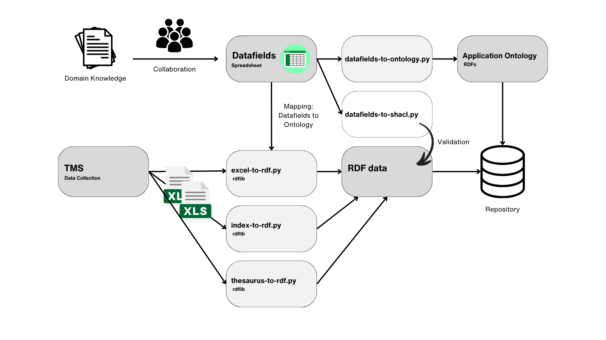

# Sharing the CROWN – Establishing a Workflow from Collection Data to Linked Research Data

[CLARIAH-AT - Funding Call 2022: Interoperability and Reusability of DH Data and Tools](https://clariah.at/project-funding)

* Project Investigator (KHM): Dr Martina Griesser, KHM-Museumsverband, Vienna
* Project Investigator (ZIM): Christopher Pollin, ZIM, University of Graz

## Introduction

### About the CROWN Project

The CROWN project is an interdisciplinary research project focusing on the Imperial Crown of the Holy Roman Empire. It combines fields such as art history, history, conservation science and technological analysis. The aim is to understand the material composition of the crown, its historical significance and its state of conservation.

At the heart of the project is a detailed examination of the physical characteristics of the crown, including all its different parts and components, such as its gemstone settings, wires and plates. We will call these components `crown:Object`. Advanced methods such as Raman spectroscopy, µ-XRF analysis, 3D digital microscopy and others are key to these studies. They provide insights into the physical composition of the different materials in each component, and thus into the working techniques and the condition of the crown.

The project also examines the history of the crown. This includes studying the inscriptions, analysing stylistic features within their historical periods, and considering how the crown has been depicted in historical records. The study also looks at the design and decoration of the crown from a symbolic point of view, in order to understand its significance as an emblem of divine authority. For this reason, additional sources on the crown and its history are also included in the project. All these sources, from charters to images and physical objects, are summarised as `crown:AdditionalMaterial`.

### CLARIAH-AT: “Sharing the CROWN – Establishing a Workflow from Collection Data to Linked Research Data”

The project, supported by CLARIAH-AT, aims to improve the accessibility and reusability of museum research data through improved data creatin workflows. Due to the complexity and historical value of the Crown, the project addresses the difficulties of handling, analysing and disseminating specialised research data resulting from cross-disciplinary studies of the Crown.

Its primary objective is to establish best practice for transforming data from The Museum System (TMS) into data that is Findable, Accessible, Interoperable and Reusable (FAIR). This process goes beyond traditional data management to address the complex needs of museum research, which often lacks standard data capture and standardisation methods. A critical part of this effort is the creation of a structured RDF data and lightweight application ontology, based on the principles of the [CIDOC Conceptual Reference Model (CIDOC-CRM)](https://www.cidoc-crm.org). This ontology acts as a structure for linking data points to controlled vocabularies and Wikidata, adding a semantic layer.

The project consists of several key tasks and packages, such as developing a domain-specific application ontology, converting the TMS data into a Linked Open Data (LOD) and FAIR RDF dataset, semantically enriching the data by aligning it with resources such as Wikidata, and creating a prototype in [GAMS](https://gams.uni-graz.at/) for accessing the data. These steps are designed to address the unique challenges of managing complex research data in the museum environment, from initial data modelling to the final analysis and presentation of linked research data.

### Overview of the Workflow

The workflow begins with data collection using The Museum System (TMS). TMS allows data to be exported in Excel format, with a variety of data fields tailored to the needs of the museum's operations and the specifics of individual objects.

Once extracted, the data fields spreadsheet becomes a critical intermediary. This is where domain experts work together to define and refine the data fields that TMS will use. They provide translations for field names and establish definitions for each field, ensuring clarity and consistency across the dataset. This spreadsheet is integral to the mapping process, where data fields are linked to corresponding elements in the ontology being developed.

Two Python scripts, excel-to-rdf.py and index-to-rdf.py, are used to transform the data from its original Excel export into RDF (Resource Description Framework) format, a standard model for data exchange on the web. The excel-to-rdf.py script does most of the transformation. It uses the property paths from the datafields spreadsheet to map the Excel fields to the ontology. During this process, additional data normalisation is performed, allowing for the integration of further logic that may be required for the unique requirements of the project.

The index-to-rdf.py script complements the first by focusing on creating RDF files for required index files such as material and person indexes.

An additional script, datafields-to-ontology.py, is responsible for extracting mappings from the datafields spreadsheet. It uses additional knowledge, presumably from domain experts, to create the full RDFs data model: the so called "CROWN"-ontology, a lightweight application ontology. This ontology, tailored for the CROWN project, is essential for structuring the RDF data. It also specifies the mappings to other ontologies such as CIDOC-CRM, which facilitates alignment with wider standards in cultural heritage documentation.

The whole process is indicative of a well-integrated approach to transforming raw museum data into a structured and semantically rich format. This methodology is instrumental in improving the accessibility and interoperability of research data within the wider digital humanities and cultural heritage communities.

### Objectives of the Documentation
The primary objective is to guide users through the data transformation processes implemented in the CROWN Project, ensuring clarity, reproducibility, and adherence to best practices in data modelling.

### Target Audience
This documentation is intended for academics, digital humanities, cultural heritage, linked open data community and developers involved in museum data management and ontology engineering, specifically those working with TMS, RDF, and related technologies.

## Prerequisites

- Basic understanding of museum data management
- Knowledge of RDF and ontological structures
- Technical requirements include proficiency in Python, ability to work with Excel and Google Spreadsheets, and API access

## Section 1: Understanding TMS and the Datafields Spreadsheet

The Museum System (TMS)

### Overview over TMS Excel Export.

1. CROWN_Objects_1_2024_02_02.xlsx
Details of various objects, presumably part of a collection.
Key Fields: ObjectID, ObjectNumber, SortNumber, ObjectName, Dated, Medium, Dimensions, Description, Notes, ShortText8, Authority50ID, Bestandteil.
Records detailed descriptions and conditions of objects, including material (Medium), dimensions, and specific notes on condition or features. The Authority50ID and Bestandteil define a relationship to other parts.
2. CROWN_Objects_3_TextEntries_2024_02_02.xlsx
Primary Focus: Text entries related to the objects.
Key Fields: ID, TextType, TextEntry.
Appears to store additional descriptive or historical text information related to objects, possibly for display or documentation purposes.
TextType contains Bemerkung, Beschreibung, Bildbeschreibung, Notiz, Transkription, Literaturzitat, Recherchenotiz, Beschriftung
3. CROWN_Objects_4_AltNumbers_2024_02_02.xlsx
Primary Focus: Alternate numbering or identifiers for objects.
Key Fields: ID, AltNumDescription, AltNum.
Provides alternate identifiers or links to additional resources, potentially offering cross-references to external databases or digital collections.
4. CROWN_Objects_5_Constituents_2024_02_02.xlsx
Primary Focus: Constituent information related to the objects.
Key Fields: ObjectID, DisplayOrder, Role, DisplayName, ConstituentID.
Details on individuals or institutions associated with the objects, such persons involved in an analysis
5. CROWN_Objects_6_Medien_2024_02_02.xlsx
Primary Focus: Media related to the objects.
Key Fields: ObjectID, TableID, DisplayOrder, MediaMasterID, RenditionNumber, MediaType, Path, FileName.
Manages digital media associated with objects, including images and documents. The path and filename fields indicate the storage location within TMS.
6. CROWN_Restaurierung_1_2024_02_02.xlsx
Information for analysis events.
Key Fields: ID, ObjectNumber, ExaminerID, dbo_Constituents_DisplayName, Examiner2ID, SurveyISODate, SurveyType, Project, ConditionID.
Records details on analysis  assessments, including examiners and survey types. Is used for tracking analysis events.
7. CROWN_Restaurierung_2_2024_02_02.xlsx
Primary Focus: Detailed restoration actions.
Key Fields: ConditionID, CondLineItemID, AttributeType, BriefDescription, Statement, Proposal, ActionTaken, DateCompleted, Treatment.
Provides a deeper dive into specific restoration and analysis treatments, actions taken, and proposals for future conservation efforts.
8. CROWN_Restaurierung_3_Medien_2024_02_02.xlsx
Primary Focus: Media related to restoration and analysis.
Key Fields: CondLineItemID, TableID, DisplayOrder, MediaMasterID, RenditionNumber, MediaType, Path, FileName.
Focuses on documenting restoration through media, potentially including before/after images, reports, or scans.
9. Crown_Userfields_2024_02_02.xlsx
Primary Focus: Custom user-defined fields for objects.
Key Fields: ObjectNumber, ID, UserFieldName, FieldValue, GroupName, UserFieldGroupID, NumericFieldValue, DisplayOrder, UserFieldID.
Defines all project specific TMS data fields explicitly created for the CROWN project. The structure of this table is different from the other tables. It defines the data field in "UserFieldName" and the corresponding value in "FieldValue". For the object with the ID "1481717" there is a user field "Form:" with the value "viereckig". "UserFieldName" is mapped to the "Property Path" column in the Data Fields spreadsheet.

### 1.2 Datafields Spreadsheet

The Datafields spreadsheet implemented in Google Spreadsheets offers several benefits.  Real-time collaboration between multiple users is streamlined, allowing for simultaneous editing. This enables a more efficient workflow, especially when drawing on the expertise of different individuals or teams. Google Spreadsheets' built-in version control system automatically logs all changes. Another advantage of Google Spreadsheets is that the Google Spreadsheets API allows programmatic interaction with the Datafields spreadsheet. Using a non-commercial production and working with CSV, howser is also possible. 

In the context of museum databases, the ability to define custom data fields is essential. Museums house diverse collections ranging from archaeological artifacts to modern art, each with unique characteristics and historical contexts. Custom data fields allow museums to tailor their data management practices to the specific needs of their collections, enabling precise documentation, analysis, and sharing of information about each object. This workflow, even though it requires modelling and programming expertise, allowsa this complexity to be managed.

#### Spreadsheet Structure and Headers
- **GroupName: german/english**: Organizes fields into logical groups or categories, making the spreadsheet easier to navigate and aligning with the museum's internal taxonomy.
- **Property Path**: Specifies the exact path used in RDF modeling to ensure mapping to RDF classes and properties.
- **Datatype**: Defines the type of data (e.g., integer, text, date).
- **UserfieldName: german/english**: The field name as used in the database, provided in both English and German to support bilingual documentation and international collaboration. The German user field is the string used for matching in the TMS export.
- **Definition: german/english**: A description of the field, its contents, and how it should be interpreted. Used for rdfs:label in the application ontology.

## Section 2: Data Transformation Scripts

### 2.1 The excel-to-rdf.py Script

This section provides an overview of the `excel-to-rdf.py` script, designed to convert data from Excel spreadsheets into RDF (Resource Description Framework) format.

#### Detailed Script Functionality

The script reads data from multiple Excel files related to the CROWN project, processes this data, and outputs RDF/XML files. Key functionalities include:

- **Reading Excel Files**: Utilizes pandas to load data from specified Excel files into dataframes for processing.
- **RDF Graph Construction**: Employs the rdflib library to build an RDF graph for each object described in the Excel data, adding various types of metadata and relationships.
- **Data Reconciliation**: Incorporates reconciliation of specific data fields against external sources like Wikidata to enhance data quality and interoperability.
- **Normalization and Formatting**: Applies several normalization and formatting routines to ensure data consistency and compatibility with RDF standards.

#### Input and Output Format

**Input Format**: The script expects data from The Museum System (TMS) exported into Excel files.

**Output Format**: The script generates RDF/XML files. Each file represents an RDF graph for a single object from the input data, including all relevant metadata, relationships, and linked external resources.

#### Mapping Process and Data Normalization

**Mapping Process**: The script maps fields from Excel files to RDF properties based on predefined mappings. These mappings are critical for converting spreadsheet data into a structured format that aligns with the project's ontology.

**Data Normalization**:
- **String Normalization**: Includes removing unnecessary spaces, converting umlauts, and formatting strings for URIs and JSON.
- **Data Type Conversions**: Converts numeric data and formats dates appropriately for RDF.
- **File Extension Handling**: Translates file extensions into MIME types for media files.

#### Code Walkthrough and Execution

1. **Preparation**:
   - Ensure all dependencies are installed, including pandas, rdflib, and any other required libraries.
   - Verify that Excel files are accessible and in the correct format.

2. **Execution**:
   - Run the script with Python. Adjust paths to Excel files and output directories as needed in the script's global variables section.
   - The script processes each object in turn, building an RDF graph and saving it as an XML file.

### 2.2 The index-to-rdf.py Script

#### Purpose of Indexing in RDF Creation
The rationale behind using indexing when creating RDF files, focusing on materials and persons.

#### Handling Material and Person Indexes
A guide to managing material and person indexes within the RDF creation process.

#### Step-by-Step Guide to Script Usage
Instructions for using the `index-to-rdf.py` script, including setup, execution, and troubleshooting.

### 2.3 The datafields-to-ontology.py Script

#### Role in Ontology Creation
An overview of how the `datafields-to-ontology.py` script contributes to the creation of the Application Ontology.

#### Extracting and Combining Mappings
Details on how the script extracts mappings from the Datafields Spreadsheet and combines them with additional domain knowledge.

#### CIDOC-CRM Integration
Guidance on integrating the CIDOC-CRM model into the Application Ontology.

#### Script Explanation and Implementation
An explanation of the script's functionality and instructions for its implementation.

## Section 3: Developing the Application Ontology

### 3.1 Introduction to the "CROWN" Ontology

#### Overview of the CROWN Ontology Structure
A description of the structure and components of the CROWN Ontology, which outlines the data model for the RDF data.

#### Mapping to CIDOC-CRM
Details on the process and benefits of mapping the CROWN Ontology to the CIDOC-CRM standards.

### 3.2 Building the Ontology

#### Defining Classes and Properties
A guide to defining classes and properties within the ontology to ensure accurate representation of data.

#### Creating RDF Data Models
Step-by-step instructions for creating RDF data models that adhere to the ontology's structure.

#### Best Practices for Ontology Development
A compilation of best practices to follow when developing and refining the ontology to enhance data interoperability and accuracy.
